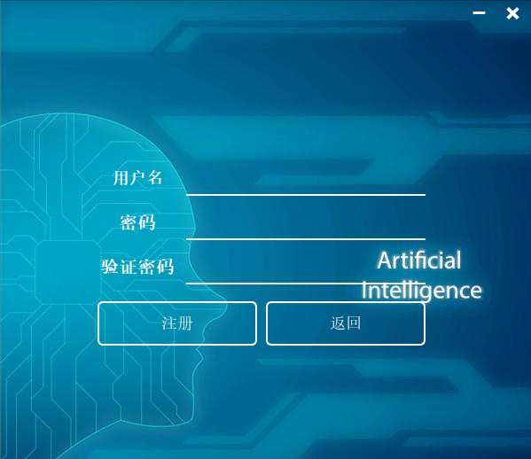
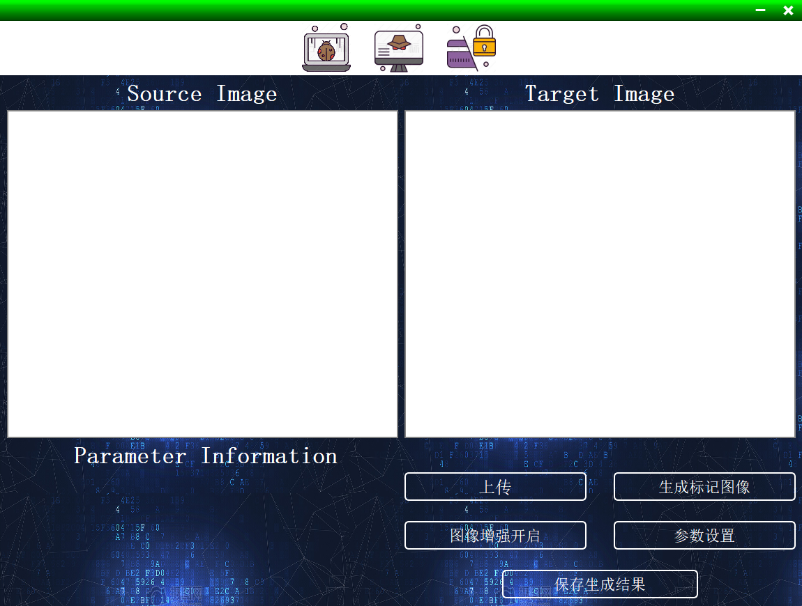
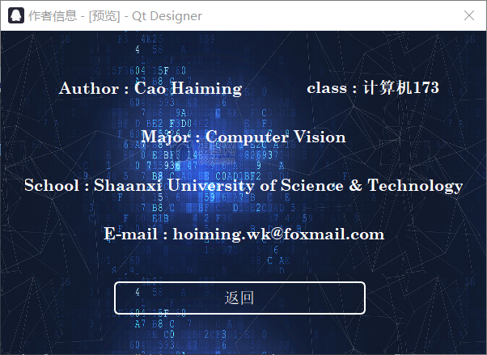
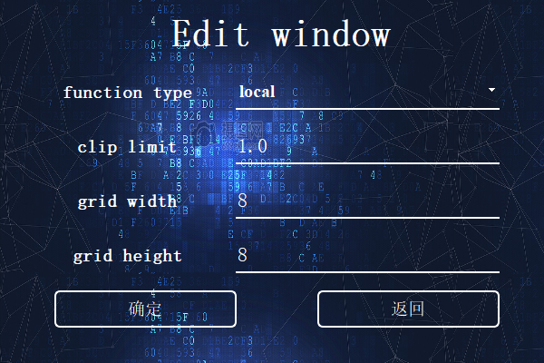

# Beautiful-Interface

## introduction ##

    1. There are several good-looking interfaces. These interfaces was coded using python.

    2. These interfaces are designed by myself dependently, So all files are open-source.

    3. If you have any questions , i'm willing to communicate with you .

## performance ##

    1. Login window ( login.py file )

    2. sign up window ( SignUp.py file )

    3. main window ( mainWindow.py file )

    4. info window ( info.py file )

    5. parameters modification window ( paraModify.py file )

## usage ##

    1. run main.py
    2. The SignUp function is available and account information is stored in binary files
